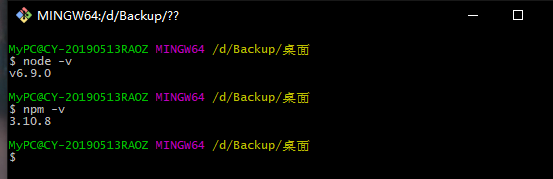
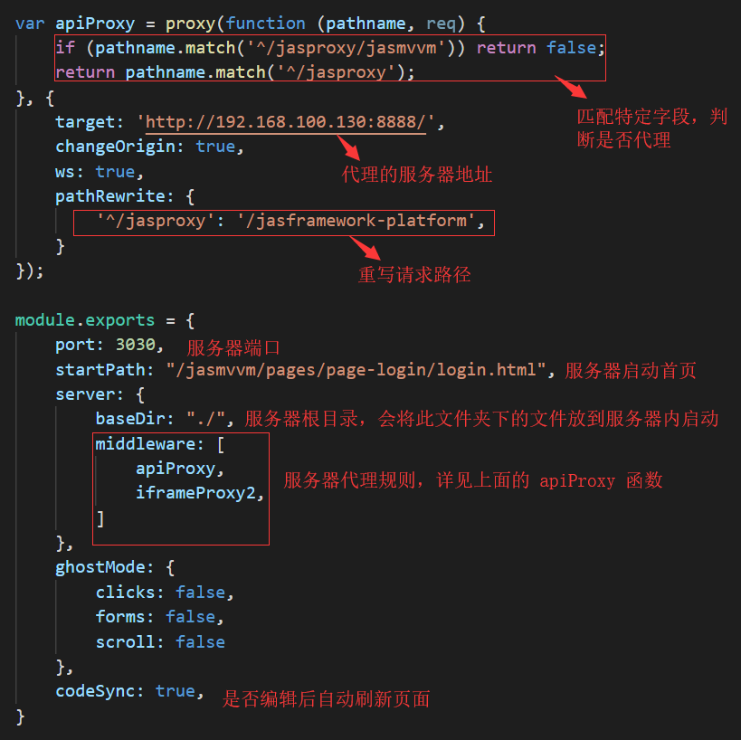
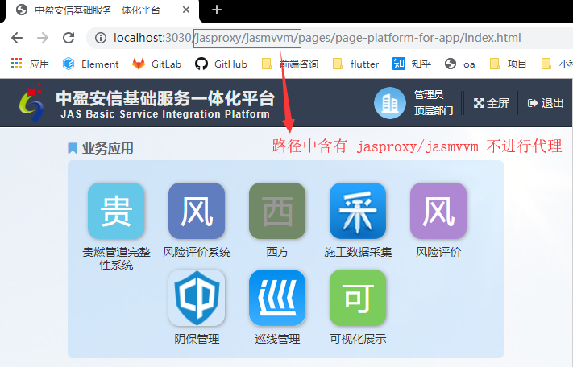
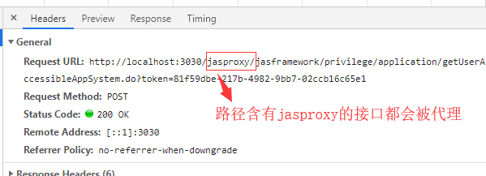
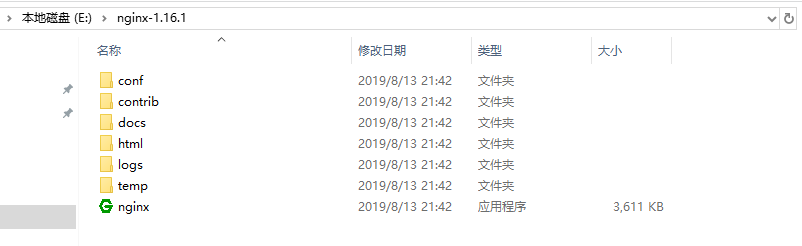
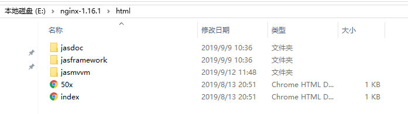
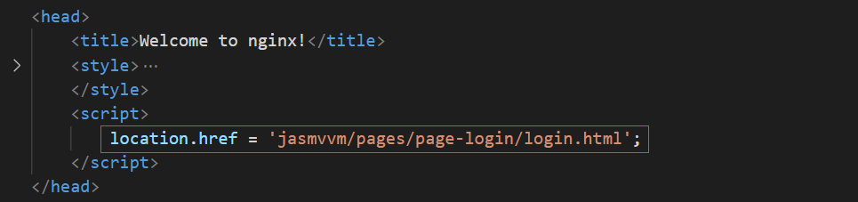

# 前后端分离开发说明

[TOC]

## 目前的问题

根据目前项目开发现状，总结如下问题：

	- 每次改动前端代码，使用 Eclipse 重新发布，等待时间过长
	- 浏览器资源缓存，更新的代码未加载，必须手动清理缓存
	- 有些项目太大，使用 Eclipse 启动后，电脑卡顿，重新发布耗时更长
	- 无法自动排查js语法错误
	- 无法自动格式化前端代码
	- ...


## 解决方案

使用vsCode编辑器，编写前端代码

在任意一台电脑启动后端项目，提供接口服务

基于node环境，使用node服务器启动前端项目，并代理后端接口


## 在开发环境实现前后端分离开发

### 安装node环境

前往 [node下载地址](<http://nodejs.cn/download/>) ，下载node并安装，安装成功后在命令行工具中检测安装正确与否，成功显示版本号表示安装成功（npm会随着node一起被安装）




### 使用npm安装服务器

1. 将【package.json】文件放到项目根目录下
2. 在根目录下打开命令行工具，执行 **npm i** 命令，此命令会根据【package.json】内的配置，从npm平台下载相关的包，自动放到当前目录下的【node_modules】文件夹下


### 修改服务器的配置文件

1. 将【bs-config.js】文件放到项目根目录下

2. 修改此文件内的配置信息，其他详细配置，请点击[配置说明](<http://www.browsersync.cn/docs/options/#option-server>)进行查看

   ​	

   
   
   
   
### 启动服务器

在根目录下打开命令行工具，执行 **npm start** 命令，一般在10秒钟之内，系统会自动在默认浏览器中打开上面配置的主页，注意所有的请求路径都会走代理的配置，包含页面、图片、资源、服务接口，合理地配置代理是重中之重。根据上面的代理配置，结果如下：




 




## 在生产环境使用Nginx部署前端项目

以下方法只适用于windows系统

### 安装Nginx服务器

去Nginx官网下载 [Nginx Stable version](<http://nginx.org/en/download.html>)，解压到任意文件夹（如：E盘根目录），得到如下目录




### 拷贝前端代码到服务器

1. 将前端项目源码拷贝到 【html】文件夹下，如下图所示

   

2. 在【html】文件夹下的【index.html】（服务器的默认起始页）内，添加js代码，用来跳转到实际项目的起始页，一般为登录页

   


### 修改Nginx配置文件

1. 打开nginx的配置文件，在nginx根目录下的【config】文件夹中的【nginx.conf】文件。

2. 修改端口号、域名、代理等配置

   ```
   server {
           listen       80; #端口号
           server_name  localhost; #域名
           root   html; #前端项目根目录
           location / { 
               index  index.html; #服务器默认起始页
           }
           error_page   500 502 503 504  /50x.html;
           location = /50x.html {
               root   html;
           }
           location /jasproxy { #接口的匹配规则
               rewrite  ^/jasproxy/jasmvvm/(.*)$  /jasmvvm/$1 permanent; #路径重写
               rewrite  ^/jasproxy/(.*)$  /jasframework-platform/$1 break;
               proxy_pass   http://192.168.100.130:8888; #代理到的后端服务器地址
           }
           location /jasframework { 
               rewrite  ^/jasframework/jasframework/(.*)$  /jasframework/$1 permanent;
               rewrite  ^/jasframework/jasmvvm/(.*)$  /jasmvvm/$1 permanent;
               rewrite  ^/jasframework/jasdoc/(.*)$  /jasdoc/$1 permanent;
           }       
   }
   ```

   【注意】此处的代理规则，同开发环境中node服务器的代理规则一致

   【注意】若开发过程没有前后端分离开发，需要自行根据接口形式按情况配置代理

   

### 启动与关闭Nginx服务器

1. 点击【nginx.exe】应用程序，启动服务器
2. 打开CMD管理工具，进入 nginx.exe所在目录，输入【 nginx.exe  -s  stop】，关闭服务器


